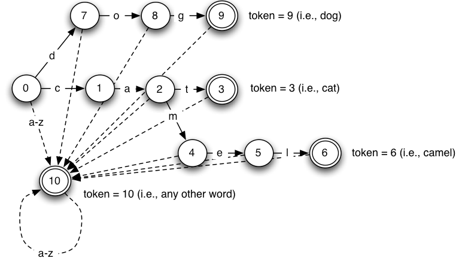
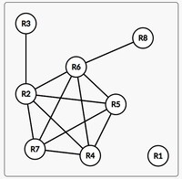
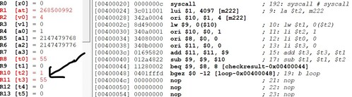

# mahl-compiler

This was a project at the Faculty of Technical Sciences in the subject System Software
The theme of the project is the MAHL compiler (high level mips assembler). Mahl is a tool that
translates a program written in a higher assembly language into a basic assembly language. Senior MIPS
The 32bit assembly language serves easier assembly programming because it introduces the concept of a registry
variables, the concept of functions and memory variables. Registry variables allow
developers to use variables instead of real resources when writing instructions. This
greatly simplifies programming because the programmer does not have to take into account the registers used and
their content.    
**List of instructions supported by the compiler:**
* add – (addition)
* addi – (addition immediate)
* b – (unconditional branch)
* bltz – (branch on less than zero)
* la – (load address)
* li – (load immediate)
* lw – (load word)
* nop – (no operation) 
* sub – (subtraction)
* sw – (store word)
* and – (logical and)
* sge – (set greater then equal)
* beq – (branch on equal) 
 

**Registry variable syntax:**
 _reg varName, varName must begin with a lowercase letter r, below can be any number
 
**Memory variable syntax:**
 _mem varName, varName must begin with a lowercase letter m, below can be any number
 
**Function syntax:**
 _func foo, foo must begin with letter, below can be any sequence of numbers and letters

#### Problem analysis

At the entrance to compiler we get a mahl file that needs to be translated into a burning mips
assembly code respecting the limitations of the target architecture. All functions need to be generated as
labels and put function names in the **.globl** section of the output mips file. It is necessary to put all memory variables in a special **.data** section, and all the instructions together with the corresponding labels in **.text** section. 
Here are some of the issues that need to be addressed in the case of the mahl compiler:
* how to know which words belong to the grammar of a language
* how to know if the input program is syntactically correct
* how to select the appropriate instructions for the target architecture
* how to replace registry variables with real resources… (our architecture has 4
register available)
 
Many of these problems contain minor subproblems that need to be solved and merged into
one whole. Possible solutions will be discussed below.

### Solution concept

##### Lexical analysis
In order to get valid tokens from the input program, we must perform a lexical analysis.
We will use a finite state machine. Initially the compiler supports a certain number of
characters and conditions. The main idea is to have states from which we move with each other. If
in some state an inappropriate token appears we report an error.

In the picture above we can see an example of a state machine. In the above case we have three
end states representing tokens for the keywords **dog**, **cat**, **camel**. If we get into
some of these states and letter appear as the next character for example, then we move into the state of
any words.

##### Syntax analysis

After the lexical one, a syntactic analysis follows where we check whether the input program is syntactically correct.
The inputs for this phase are a list of tokens we obtained from lexical analysis and grammars
source language. Syntax analysis was realized with a recursive descent algorithm. We will first
state the grammar of the language and then explain the algorithm.

<pre>
Q → S ; L     S → _mem mid num     L → eof     E → add rid, rid, rid 
              S → _reg rid         L → Q       E → addi rid, rid, num
              S → _func id                     E → sub rid, rid, rid
              S → id: E                        E → la rid, mid
              S → E                            E → lw rid, num(rid)
                                               E → li rid, num
                                               E → sw rid, num(rid) 
                                               E → b id
                                               E → bltz rid, id
                                               E → nop
                                               E → and rid, rid, rid
                                               E → sge rid, rid, rid
                                               E → beq rid, rid, id
</pre>

The terminal symbols of the mahl language are: 
: ; , ( )
_mem, _reg, _func, num id, rid, mid, eof, add, addi, sub, la, lw, li, sw, b, bltz, nop ,and, sge, beq

###### Recursive descent algorithm
We will need 4 functions for each of the productions Q, S, L, E. We make a chain of recursive calls.
The idea is to look at the whole program as a whole and try to recursively pull tokens
in line with the grammar. If an unexpected token appears, we report an error. Syntax 
analysis is successful if we have reached the end of the file and have not encountered an error.

##### Instructions selection and creation of flow graph
If the parsing passes without errors, we form an intermediate tree and then make a selection
instruction. Since this is a simplified compiler, we have no need to make a tree
intermediate code, and we don't need to do its tiling.  
Since we have the instructions in good shape, as soon as the parsing went smoothly, we can
to use a list of tokens from lexical analysis for the purpose of forming instructions. We do this first and foremost
to separate the parse code from the instruction generation code. We could have worked
all in one pass but then we would have to first check if something is syntactically correct
and only then to make potential instructions, if we do it in two passes, the division is clearer
responsibilities.  
We make instructions by reading the appropriate tokens, since we know the exact format
instructions, it can't happen that we get some unexpected token. It should be emphasized that it is done here
and semantic verification. For example, we cannot use a registry that we did not have before
declared, or it can't happen that we have two labels with the same name, etc ... All checks like this
type we work in this second pass through the token list in the instruction selection phase.  
When we made the instructions, we still had to add the links between the tokens. Every instruction has
their followers and predecessors. If we have a jump instruction, that means we will in the list of 
predecessors of the instruction to which we jump to add the current instruction and in the list of followers of the current
instructions we will add the instruction to which we jump.

##### Liveness analysis
Once we have formed a flow graph, we can perform a liveness analysis. The goal is to
determine which variables are alive at the input of instruction (IN set) and which are alive in instruction
output (OUT set). We will need this information later in determining the life span of
variables and their mutual interference.  
We create IN and OUT sets according to the following rule. The OUT set represents the union of the IN sets of all
followers of the observed instruction in the control flow graph, and the IN set represents all variables
which are in the USE set and all variables that are alive at the output and are not defined in
that node.

##### Resource allocation
The last phase is the resource allocation phase. It was realized in several steps.

###### Creation of interference graph
The interference graph serves us to determine between which variables exist interference. If
there is an interference between variables A and B, then the number 1 will be in the appropriate place in the graph, or 0 if there is no interference.
We make this graph as follows. We go through all the instructions and for each variable from the DEF set we go through every
variable from the OUT set of that instruction and we make interference.

###### Creation of simplification stack
Since we will be coloring the graph to allocate resources, we will use the graph simplification technique to be
sure we can color the graph with enough colors (i.e. registers of the target architecture).
We take the variable with the highest rank such that the rank satisfies the condition that it is less than or equal to
number of registers we have reduced by one. This includes the worst
scenario that all neighbors are painted with different colors. Since there is K - 1 neighbors, together with obrserved node there is K colors,
which corresponds to the number of registers. We repeat this procedure until we remove all variables from the interference graph. If it happens that we can't
simplify the graph, we report an error because there is the possibility that a spill has occurred, 
occurrence that we use main memory because we do not have enough registers on the target architecture.

###### Coloring registers
The last step is to assign specific registers to the variables. We do this by taking variables from simplification stack, we look
at colors of variables that has interference with observed variable. The goal is just to color the variable with some color so that there are no neighbors
which have the same color. At this stage, there may be an overflow if we find that we do not have enough
registers, then we report the error and the overflow notification.

##### Testing

###### Testing without spill
We will first test the case when there is no overflow. The following follows
a simple mahl program that adds two numbers and then a valid mips output code.
<pre>
_mem m1 6;
_mem m2 5;

_reg r1;
_reg r2;
_reg r3;
_reg r4;
_reg r5;

_func main; 
	la		r4,m1;
	lw		r1, 0(r4);
	la		r5, m2;
	lw		r2, 0(r5);
	add		r3, r1, r2;
</pre>

Genereted mips code:
<pre>
.globl main

.data
m1: .word 6
m2: .word 5

.text
main:
	la $t0, m1
	lw $t1, 0($t0)
	la $t0, m2
	lw $t0, 0($t0)
	add $t0, $t1, $t0
</pre>

In this simple example for 5 register variables we form an interference graph which looks like this:

<pre>
|     |  R1  |  R2  |  R3  |  R4  |  R5  |
|_____|______|______|______|______|______|
| R1  |      |  X   |      |      |  X   |
| R2  |  X   |      |      |      |      | 
| R3  |      |      |      |      |      |
| R4  |      |      |      |      |      |
| R5  |  X   |      |      |      |      |
</pre>

As we can see, there is an interference between r1 and r2 and an interference between r1 and r5. Since r2 and r5 are not interfering
it is enough to use two colors to color this graph. In the output we can see that
we used 2 registers, $ t0 and $ t1.

##### Testing with spill
As mentioned earlier, in some cases there may be an overflow, that is, we do not have
enough registers that we can assign to variables and we have to overflow some of them into
some other memory. In this project, a direct solution to this problem is avoided, and in
these cases, only an error is detected and the program ends.
The input file **multiply.mavn** contains 8 register variables that form the following interference graph:

<pre>
|    | R1 | R2 | R3 | R4 | R5 | R6 | R7 | R8 |
|____|____|____|____|____|____|____|____|____|
| R1 |    |    |    |    |    |    |    |    |
| R2 |    |    | X  | X  | X  | X  | X  |    |
| R3 |    | X  |    |    |    |    |    |    |
| R4 |    | X  |    |    | X  | X  | X  |    |
| R5 |    | X  |    | X  |    | X  | X  |    |
| R6 |    | X  |    | X  | X  |    | X  | X  |
| R7 |    | X  |    | X  | X  | X  |    |    |
| R8 |    |    |    |    |    | X  |    |    |
</pre>

Below is a graph visually  

As we can see from the picture the variables R7, R4, R5, R6, R2 form a click, and to color that part
we need 5 colors, and we only have 4. In this case, overflow detection is reported.
In order not to leave the multiply.mavn file untranslated, I added another register to make the translation possible.

###### Additional testing
In the examples **folder** there are some additional examples where it is possible to test the correctness of mahl
translator. For example, the file **addFirstN.mavn** sums the first N numbers (for example, the first 10 are taken).
Checking the correctness of this code is possible using a simulator. **QtSpim** was used for this project.
The following figure shows a screenshot from the simulator, where the final result is placed in t3

